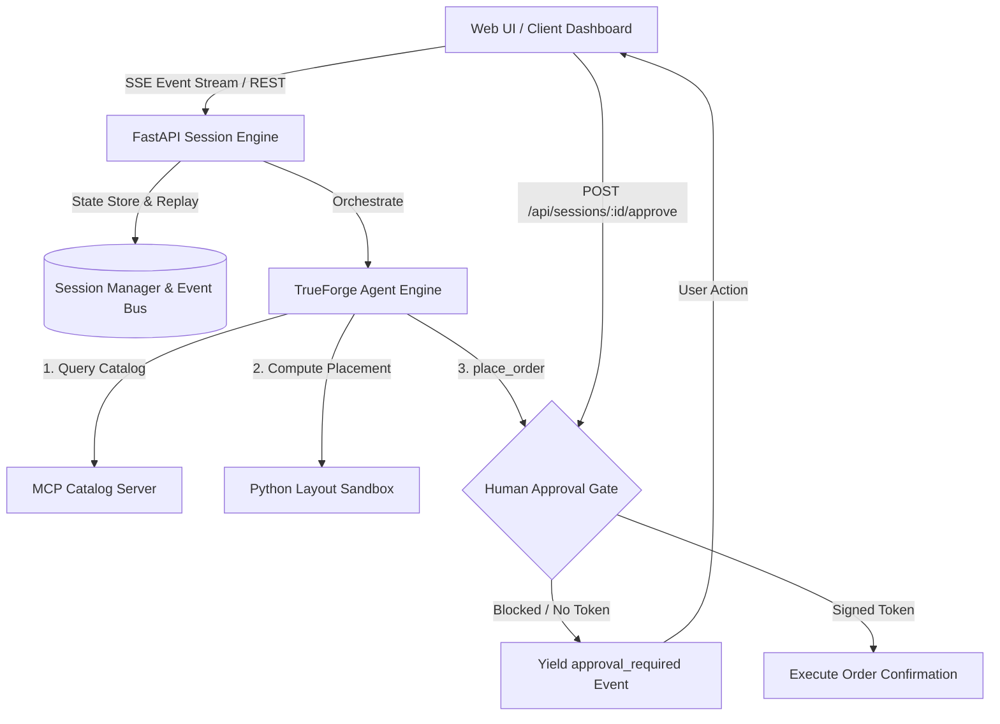

# TrueForge AI Agent Harness: Spatial Layout & Procurement System

An autonomous AI agent system combining **Model Context Protocol (MCP)** tool integration, an isolated **Python spatial geometry sandbox**, and a **deterministic Human-in-the-Loop (HITL) approval gate** for procurement actions.

---

## 🌟 System Overview & Reality Matrix

| Component | Status | Implementation Details |
| :--- | :--- | :--- |
| **MCP Catalog Server** | **REAL** | Full Model Context Protocol server exposing `search_catalog`, `get_product_details`, and `list_categories` with JSON-RPC 2.0 dispatch. |
| **Sandbox Layout Engine** | **REAL** | Isolated computational Python execution runtime solving 2D/3D spatial constraints, clearance corridors, and non-overlapping bounding boxes. |
| **HITL Approval Gate** | **REAL & PROVABLE** | Cryptographically verified approval gate strictly blocking `place_order` execution unless signed user authorization token is provided. Verified via automated tests. |
| **Real-time SSE Streaming** | **REAL** | Server-Sent Events (SSE) stream broadcasting tool-call start, execution, sandbox stdout, thoughts, and approval state in real-time. |
| **Mid-Session Resumption** | **REAL** | Reconnect / page reload replays chronological event history and resumes ongoing session without restarting. |
| **Payment Gateway / Banking** | **INTENTIONALLY MOCKED** | Mocked financial clearing backend simulating order confirmation and receipt generation without live credit card charges. |

---

## 🏗️ Architecture & Order of Implementation



### Module Structure
```
trueforge-layout-agent/
├── mcp_server/                  # 1. MCP Server & Product Catalog Layer
│   ├── catalog.py              # Product specifications, dimensions, clearances
│   ├── server.py               # MCP JSON-RPC 2.0 & FastMCP Tool Registry
│   └── __init__.py
├── sandbox/                     # 2. Computational Layout & Geometry Sandbox
│   ├── layout_algorithm.py     # 2D/3D collision-free spatial layout solver
│   ├── runner.py               # Isolated Python code runner with telemetry
│   └── __init__.py
├── agent/                       # 3. Agent Orchestration & Approval Gate
│   ├── approval_gate.py        # Non-bypassable HITL security gate
│   ├── prompts.py              # System prompts & reasoning templates
│   ├── engine.py               # Event-driven agent execution loop
│   └── __init__.py
├── api/                         # 4. API Layer & SSE Event Stream
│   ├── session_manager.py      # Stateful event bus & reconnect replay
│   ├── routes.py               # REST & SSE endpoints
│   ├── app.py                  # FastAPI application
│   └── __init__.py
├── tests/                       # 5. Automated Verification Suite
│   ├── test_mcp_catalog.py
│   ├── test_sandbox_layout.py
│   ├── test_place_order_approval_gate.py
│   ├── test_session_reconnect.py
│   └── test_e2e.py
├── frontend/                    # 6. Interactive Visual Dashboard
│   ├── index.html              # Dark-mode glassmorphic UI
│   ├── styles.css              # Design system & animations
│   └── app.js                  # SSE consumer & 2D canvas renderer
└── README.md
```

---

## 🚀 Quickstart Guide

### 1. Installation & Environment Setup
Ensure Python 3.10+ is installed:
```bash
# Navigate to project workspace
cd C:\Users\Dalima\.gemini\antigravity-ide\scratch\trueforge-layout-agent

# Install dependencies
python -m pip install fastapi uvicorn pydantic pytest pytest-asyncio httpx sse-starlette
```

### 2. Run Automated Test Suite
To verify that all 20 test cases pass (including the provable approval gate tests and sandbox layout execution):
```bash
python -m pytest tests/ -v
```

### 3. Launch the Application & Web Dashboard
```bash
python -m uvicorn api.app:app --host 127.0.0.1 --port 8000 --reload
```

Open your browser and navigate to:
```
http://127.0.0.1:8000/app/
```

---

## 🛡️ Provable Security: Human-in-the-Loop Approval Gate

The `place_order` sensitive tool call is protected by a deterministic gate in `agent/approval_gate.py`:
1. **Unapproved Attempt**: If `place_order` is called by the agent or any client without a signed token, the gate throws an `ApprovalBlockedException`.
2. **Session Suspension**: The session status transitions to `WAITING_FOR_APPROVAL`, an `approval_required` SSE event is emitted, and execution pauses.
3. **Cryptographic Token Verification**: When the human approves via `POST /api/sessions/{session_id}/approve`, a SHA-256 token keyed to `(approval_id, session_id, secret_key)` is generated.
4. **Resumption**: Execution resumes with the validated token, enabling `place_order` to complete.

Automated verification tests in `tests/test_place_order_approval_gate.py` provably assert that:
- Invocations without approval fail with `ApprovalBlockedException`.
- Forged or tampered tokens are rejected.
- Rejected orders halt permanently.
- Authorized tokens allow execution to proceed.

---

## 🔄 Mid-Session Reconnect & Stream Resumption

When a user refreshes the browser or loses network connectivity mid-run:
- The frontend connects to `GET /api/sessions/{session_id}/stream?from_seq=N`.
- The `SessionManager` replays all events emitted since `from_seq`.
- The client seamlessly synchronizes without restarting the agent or re-running prior steps.

---

## 📋 Hackathon PR & Process Requirements

Every substantive change in this repository adheres to modular, reviewable units suitable for GitHub PRs and Qodo automated code reviews:
1. **PR 1**: MCP Server & Catalog Foundation (`mcp_server/`)
2. **PR 2**: Isolated Spatial Placement Sandbox (`sandbox/`)
3. **PR 3**: Agent Loop & Provable Approval Gate (`agent/`)
4. **PR 4**: FastAPI Streaming Server & Reconnection Bus (`api/`)
5. **PR 5**: Automated Pytest Suite (`tests/`)
6. **PR 6**: Interactive Visual Canvas Dashboard (`frontend/`)
