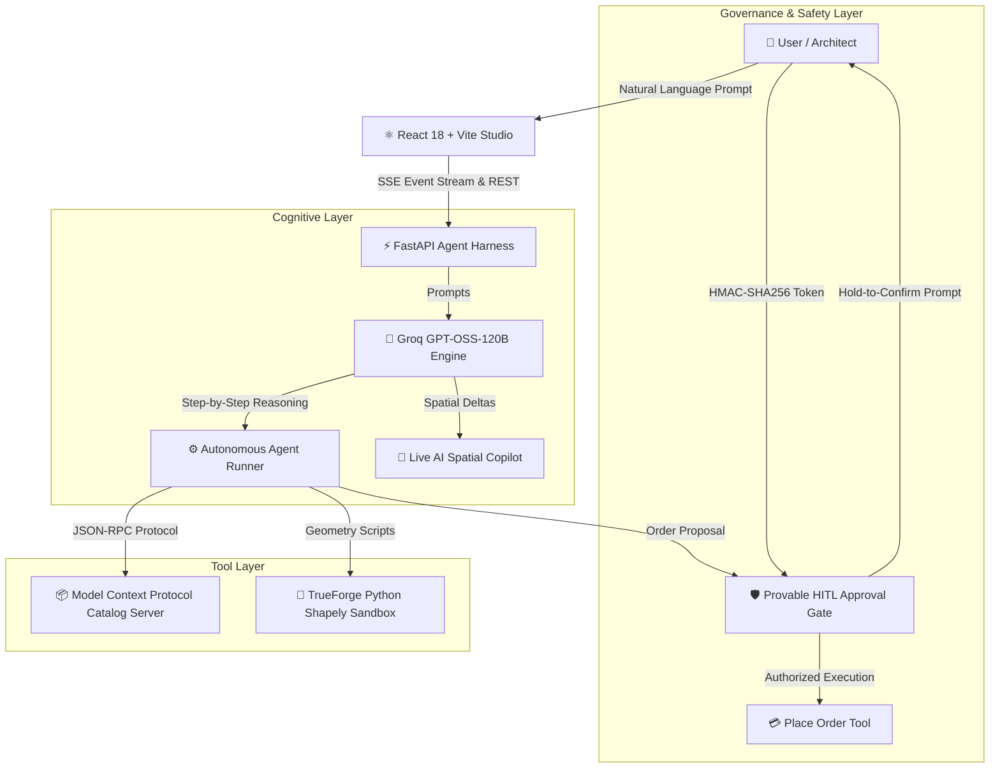

# 🏛️ ReDessIo — Autonomous Spatial Design & Procurement Agent Harness

[](https://www.python.org/)
[](https://reactjs.org/)
[](https://fastapi.tiangolo.com/)
[](https://groq.com/)
[](https://truefoundry.com/)
[](https://modelcontextprotocol.io/)
[](https://docs.pytest.org/)
[](https://www.docker.com/)

> **Watch it design. Approve before it spends.**
> An autonomous end-to-end spatial interior architecture agent that translates natural language creative intent into mathematically verified 2D CAD blueprint layouts, executes collision-free geometry packing in an isolated TrueForge Python sandbox, offers live real-time AI copilot co-design, and enforces a cryptographic Human-in-the-Loop gate before financial order placement.

---

#Deployed Link : https://agents-in-harness-repo.onrender.com/

## 🌟 Key Highlights & Features

| Capability | Description |
| :--- | :--- |
| 🏛️ **2D Architectural CAD Plan** | Top-down blueprint rendering featuring realistic furniture symbols (Platform Beds, Sectional Sofas, Desks, Coffee Tables, Nightstands, Lamps, Bookshelves) and 36" dotted circulation walkways. |
| 🤖 **Live AI Spatial Copilot** | Interactive conversational co-design powered by `openai/gpt-oss-120b` via Groq. Re-orient, rotate, and anchor furniture in real-time (`"move sofa to north wall"`, `"rotate seating 90°"`). |
| ⛶ **Fullscreen Studio Mode** | Expansive 92vh side-by-side co-design canvas with full-scale CAD drafting on the left and Live AI Copilot on the right. |
| 🎨 **5 Visual CAD Themes** | **CAD Architectural B&W Drafting**, **Classic Navy Blueprint**, **Cyber Emerald Matrix**, **Warm Editorial Minimalist**, and **OLED Pitch Black**. |
| 🗂️ **3-Tab Multimodal View** | Seamlessly toggle between **2D CAD Floor Plan**, **1ft Blueprint Spatial Grid**, and **Mood Board Material Cards**. |
| 📦 **MCP Catalog Protocol** | Standardized JSON-RPC 2.0 Model Context Protocol tool server providing category-aware furniture discovery and stock verification. |
| 🧪 **TrueForge Isolated Sandbox** | Greedy 2D rectangle packing executed with Shapely geometry in an isolated Python container with 0.0mm collision tolerance. |
| 🛡️ **Provable HITL Approval Gate** | Cryptographic approval interlock requiring explicit hold-to-confirm authorization before executing irreversible purchases. |

---

## 🏗️ System Architecture



---

## 📑 Documentation Index

Explore the detailed documentation in the [`docs/`](docs/) directory:
* 🌟 [**Features & Capabilities**](docs/FEATURES.md): Detailed breakdown of CAD symbols, copilot prompts, themes, and approval flows.
* 🏗️ [**System Architecture**](docs/ARCHITECTURE.md): Deep dive into the cognitive engine, tool layer, and event-driven harness.
* ⚡ [**TrueForge Integration**](docs/TRUEFORGE_INTEGRATION.md): How TrueFoundry / TrueForge primitives are leveraged for sandboxed execution and model hosting.
* 🧪 [**Qodo Integration & Testing**](docs/QODO_INTEGRATION.md): Test harness architecture, assertions, and verification methodology.
* 📡 [**API Reference**](docs/API_REFERENCE.md): Complete REST endpoint schemas and SSE event protocols.
* 🚀 [**Deployment Guide**](DEPLOYMENT_GUIDE.md): 1-click deployment instructions for Render, Railway, Docker, and Vercel.

---

## 🚀 Quickstart & Local Setup

### Prerequisites
* Python 3.11+
* Node.js 18+ and npm
* Groq API Key (for GPT-OSS-120B inference)

### 1. Clone & Configure
```bash
git clone https://github.com/your-username/Agents_harness_hackathon.git
cd Agents_harness_hackathon

# Configure Environment Variables
cp .env.example .env
# Open .env and insert your GROQ_API_KEY
```

### 2. Backend Setup
```bash
# Create and activate virtual environment
python -m venv venv
# Windows:
.\venv\Scripts\activate
# macOS / Linux:
source venv/bin/activate

# Install dependencies
pip install -r requirements.txt

# Start FastAPI server
uvicorn api.app:app --reload --port 8000
```

### 3. Frontend Setup
```bash
cd frontend
npm install
npm run dev
```
Open **`http://localhost:3001`** to experience the interactive Studio workspace!

---

## 🐳 Docker Deployment (Unified Single Service)

ReDessIo features a multi-stage production Dockerfile that compiles the React Vite frontend and serves it directly through FastAPI on a single port:

```bash
docker compose up --build
```
Access the production application at **`http://localhost:8000`**.

---

## 🧪 Running Verification Tests

The test harness validates the complete autonomous agent workflow with 23 end-to-end unit and integration tests:

```bash
pytest tests/ -v
```

```
============================= test session starts =============================
tests/test_e2e.py ..                                                     [  8%]
tests/test_mcp_catalog.py .........                                      [ 47%]
tests/test_place_order_approval_gate.py ....                             [ 65%]
tests/test_sandbox_layout.py .....                                       [ 86%]
tests/test_session_reconnect.py ...                                      [100%]
============================= 23 passed in 20.91s =============================
```

---

## 📜 License
This project is licensed under the MIT License — see the [LICENSE](LICENSE) file for details.
