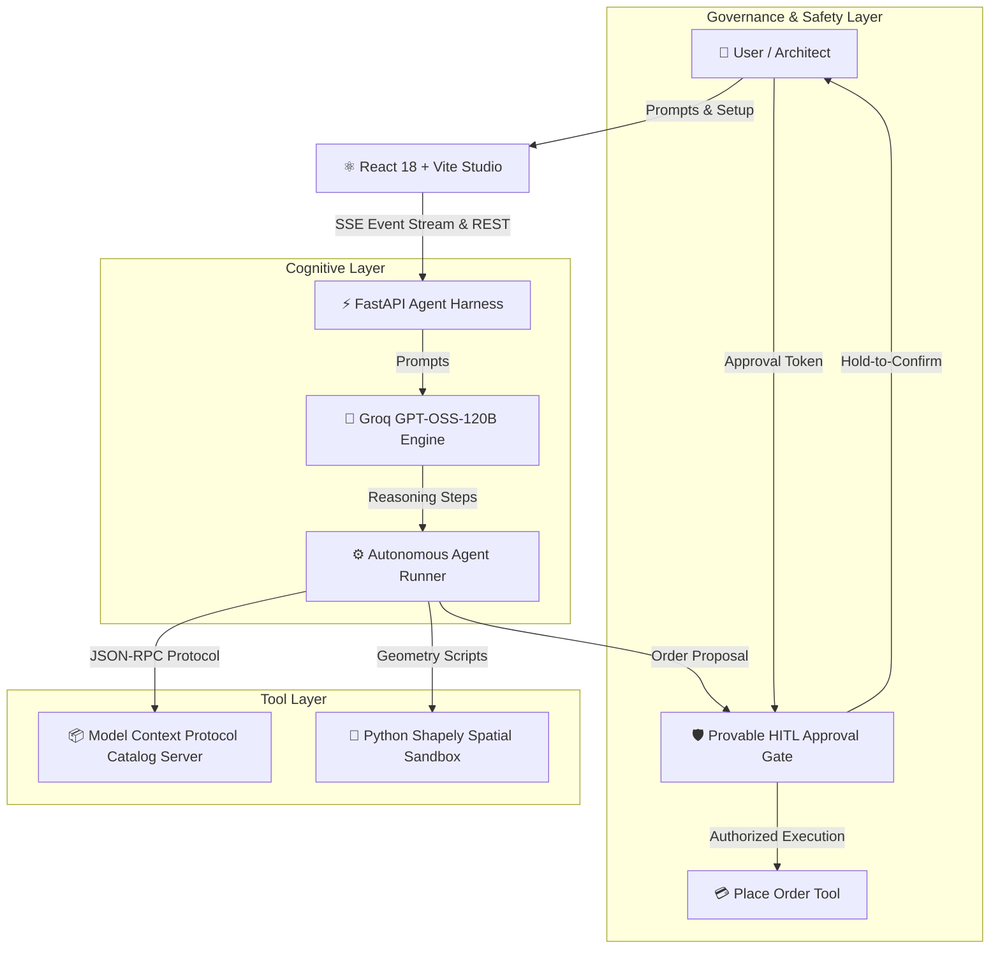

# 🏗️ ReDessIo System Architecture

ReDessIo is structured around an **Agent Harness Pattern** that decouples cognitive planning from execution tools, mathematical verification, and human authorization.

---

## 🧩 Architectural Subsystems

### 1. Agent Engine (`agent/engine.py`)
- **State Machine**: Orchestrates the multi-stage procurement lifecycle:
  1. `Architectural Planning`
  2. `Room-Type-Aware Catalog Discovery`
  3. `Item Evaluation & Curation`
  4. `Spatial Geometry Solving`
  5. `HITL Approval Halting`
  6. `Authorized Order Execution`
- **Real-Time Event Streaming**: Emits typed `AgentEvent` records over Server-Sent Events (SSE) with sequence numbering and reconnection replay.

### 2. Live AI Spatial Copilot (`agent/copilot.py`)
- **Spatial Reasoning**: Interprets user design modifications and translates them into coordinate deltas (`xFt`, `yFt`, `rotationDeg`).
- **Semantic Entity Recognition**: Targets specific furniture pieces (e.g. `"sofa"`, `"bed"`, `"desk"`) while keeping adjacent pieces coherent.

### 3. Model Context Protocol (MCP) Server (`mcp_server/catalog.py`)
- Standardized tool interface exposing:
  - `search_furniture(category, query, max_price, limit)`
  - `get_furniture_details(item_id)`
  - `validate_catalog_item(item_id)`

### 4. Isolated Python Spatial Sandbox (`sandbox/layout_algorithm.py`)
- **Algorithmic Packing**: Executes greedy 2D rectangle packing with Shapely geometry.
- **Collision Checking**: Evaluates bounding box intersections with 0.0mm tolerance and reserved door swing arcs.

### 5. HITL Approval Gate (`agent/approval_gate.py`)
- **Cryptographic Request Tokens**: Generates nonces and audit trails for sensitive financial actions.
- **Safety Interlock**: Rejects unauthorized invocations of `place_order`.

### 6. React High-Fidelity Frontend (`frontend/src/`)
- Built with **React 18**, **TypeScript**, **GSAP micro-animations**, and **Vanilla CSS tokens**.
- SVG CAD renderer with dynamic viewport transformations, 5 color themes, and fullscreen side-by-side chat copilot.
